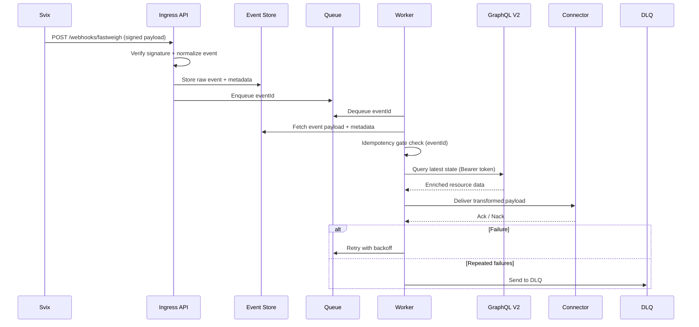

# Fast-Weigh Event Gateway

A production-grade webhook event gateway for Fast-Weigh that verifies Svix signatures, guarantees delivery (idempotency + retries + Dead Letter Queue), enriches events via GraphQL V2, and routes data to downstream systems like ERP, TMS, accounting, and BI.

## Overview

### What It Does

- Authenticates inbound Svix webhooks with signature verification
- Ensures at-least-once processing with idempotency, retries, and a Dead Letter Queue (DLQ)
- Enriches events via GraphQL V2 to produce consistent downstream payloads
- Provides admin replay and observability for recovery and troubleshooting

### Why It Reduces Support

- Fewer tickets for missed or duplicate webhook events
- Fewer customer-specific integration anti-patterns
- Faster troubleshooting with centralized gateway logs and metrics

### Why It Increases Adoption

- Makes API and webhook integrations plug-and-play
- Accelerates Dispatch and POD (Proof of Delivery) integrations across TMS (Transportation Management System), ETA (Estimated Time of Arrival), and accounting workflows

## Why This Gateway Exists

Fast-Weigh webhooks are the fastest path to real-time integrations, but production webhook consumption is difficult:

- missed events during deploys or outages
- duplicate deliveries causing double writes
- limited replay controls
- unclear observability during failures

This gateway provides a deployable, standardized integration pattern focused on reliability, recovery, and consistent downstream data.

## Key Features

- Svix signature verification with secret rotation support
- Idempotency by `eventId` and optional `resourceId+resourceVersion`
- Durable queue with retries and exponential backoff
- Dead Letter Queue with replay (`/admin/dlq/replay`)
- GraphQL V2 enrichment (Bearer token API key auth)
- Connector framework for HTTP/database/file sinks
- Admin API + embedded React admin console (`/admin/ui`)
- Structured logging + Prometheus metrics + OpenTelemetry traces
- Security controls: rate limiting, IP allowlists, admin API key, TLS guidance

## Implementation Status

Implemented:

- signature verification, idempotency, queueing, retry/DLQ/replay
- GraphQL enrichment layer and reconciliation drift/replay workflow
- connector framework with connector-level idempotency handling
- admin API + admin UI + Prometheus + OpenTelemetry tracing
- Docker packaging and Terraform starter templates

## Architecture

### High-Level Component Diagram


### Event Processing Sequence



### Admin UI Preview


## Supported Starter Use Cases

- Ticket created/updated -> ERP and invoicing sync
- Dispatch lifecycle updates -> TMS and customer ETA sync
- POD captured -> closeout + billing triggers
- Customer/order updates -> CRM/pricing sync

## Reliability Guarantees

- At-least-once delivery with idempotent processing gate
- Durable queue buffering for transient downtime
- Replayable history for audit and recovery
- Safe downstream writes through connector contracts and replay controls

## Internal Event Envelope

All events are normalized to:

- `eventId`
- `eventType`
- `occurredAt`
- `tenantId`
- `resourceId`
- `payload`
- `signatureVerified`
- `resourceVersion` (optional)
- `source` (`webhook` or `reconciliation`)

## Quick Start (Local)

1. Install dependencies:

```bash
npm install
```

2. Create `.env`:

```bash
cp .env.example .env
```

3. Set required values in `.env`:

- `FAST_WEIGH_WEBHOOK_SECRET`
- `FAST_WEIGH_API_KEY`

4. Set a Redis connection (`REDIS_URL`) using one option:

Option A: Hosted Redis:

```env
REDIS_URL=rediss://<username>:<password>@<host>:<port>
```

Option B: Local Redis via Docker:

```bash
docker run --rm -p 6379:6379 redis:7-alpine
```

Option C: Local Redis via WSL:

```bash
sudo apt update
sudo apt install redis-server -y
sudo service redis-server start
redis-cli ping
```

Then use:

```env
REDIS_URL=redis://127.0.0.1:6379
```

5. Start the app:

```bash
npm run dev
```

6. Verify:

```bash
curl http://localhost:3000/health
```

7. Open admin UI:

- `http://localhost:3000/admin/ui`

## Admin Endpoints

- `GET /admin/ui`
- `GET /admin/health`
- `GET /admin/metrics`
- `GET /admin/metrics/prometheus`
- `GET /admin/events?limit=50`
- `GET /admin/failures?limit=50`
- `GET /admin/reconciliation/latest`
- `GET /admin/reconciliation/reports?limit=10`
- `POST /admin/dlq/replay`

If `ADMIN_API_KEY` is set, send `x-admin-api-key` on `/admin/*` requests.

## Test and Validate

```bash
npm run lint
npm run test
npm run build
```

## Deployment

- Docker: `Dockerfile`, `docker-compose.yml`
- Terraform (AWS ECS Fargate template): `infra/terraform/README.md`

## Related Docs

- contracts/event map: `docs/contracts/`
- security runbooks: `docs/security/`
- observability/grafana: `docs/observability/`
- success KPIs: `docs/operations/success-metrics.md`
- quickstart flow: `docs/quickstart/portal-svix-gateway-downstream.md`
